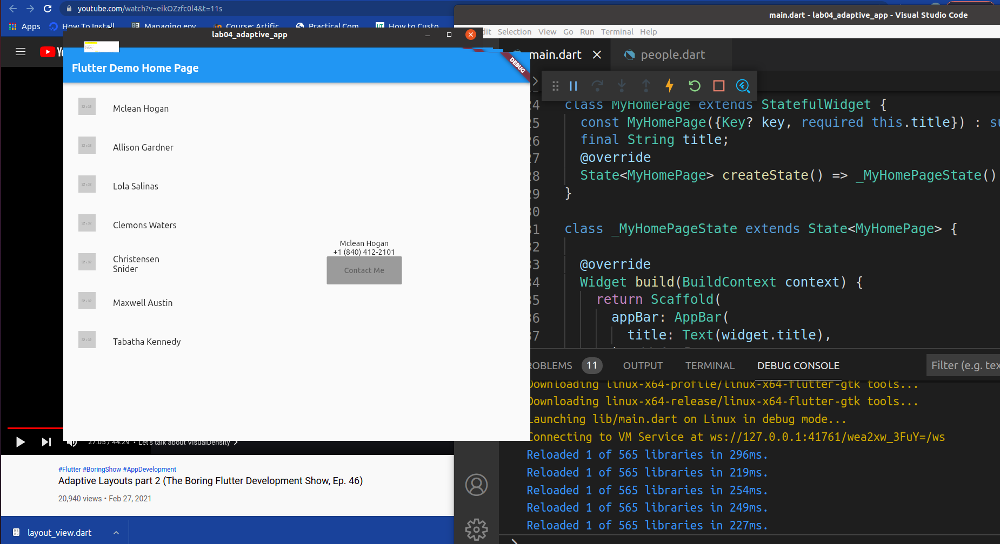
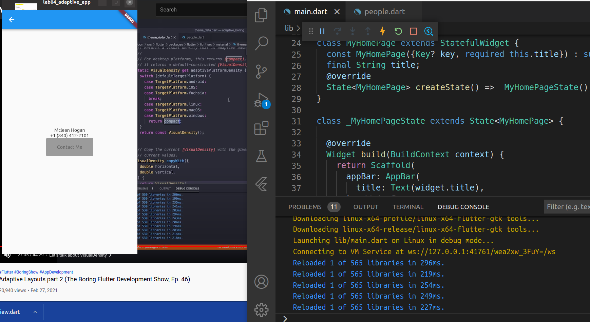

<html>
<h1>MI3.04: Mobile propramming</h1>
<h2>Student information</h2>
Student name: Dinh Anh Duc
 
Student ID: M20.ICT.001
<h2>Result</h2>
<h3>App in desktop screen mode</h3>

 
<h3>App in mobile phone screen mode</h3>

 
</html>
